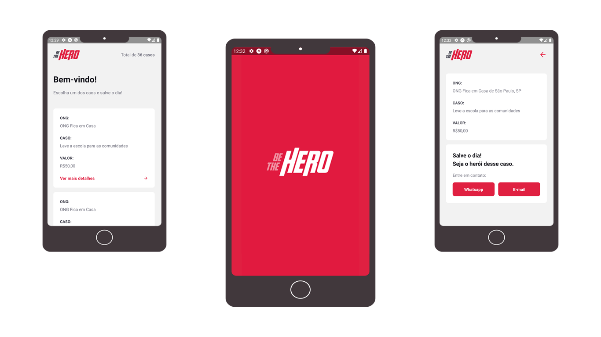

# Be the Hero - Semana Omnistack 11.0
> Peojeto criado na Semana Omnistack, proporcionada pela RocketSeat e aulas lecionadas pelo [Diogo Fernandes](https://github.com/diego3g).


>A aplicação foi desenvolvida com a finalidade de contribuir com ONGs para que elas possam continuar seu trabalho. A ONG tem uma plataforma onde podem cadastrar seus casos e solicitar ajuda ao usuário que, por sua vez, pode verificar em sua cidade as ONGs que necessitam de auxílio, fazer sua parte e se tornar herói.
>Be the Hero é uma plataforma para conectar heróis a ONGs. 




### Tecnologias utilizadas

- [Node.js](https://nodejs.org/en/)
- [Expo](https://expo.io/)
- [Express](https://expressjs.com/pt-br/)
- [ExpressJs](https://expressjs.com/pt-br/)
- [Nodemon](https://www.npmjs.com/package/nodemon)
- [Axios](https://www.npmjs.com/package/axios)
- [Cors](https://www.npmjs.com/package/cors)
- [Knex](http://knexjs.org/)
- [Jest](https://www.npmjs.com/package/jest)

### Configuração para Desenvolvimento

Clone o repositório, utilizando **git clone** ou faça o **download** do repositório.

----

Após clonar ou baixar o repositório instale as dependências necessárias:

Utilize o **npm** para instalar as dependências nas pastas *backend*, *react-frontend*, *vue-frontend*, *mobile*.

```
npm install
```
Após instalar as dependências você precisa rodar o comando do knex no **backend** para criar o banco de dados SQLite e rodar as migrações. 

```
npx knex migrate:latest
```

Após a geração do banco de dados e das migrações você poderá rodar o backend, react-frontend, vue-frontend e mobile utilizando...

**Para o backend e react-frontend:**
```
npm start
```

**Para o vue-frontend:**
```
npm run serve
```

**Para o mobile**
```
expo start
```
Para visualização da aplicação mobile utilize o celular com o aplicativo *Expo* ou emulador Android/iOS.
 
## Licença

Esse projeto está sob a licença MIT.

## Contributing

1. Faça o _fork_ do projeto
2. Crie uma _branch_ para sua modificação (`git checkout -b feature/fooBar`)
3. Faça o _commit_ (`git commit -am 'Add some fooBar'`)
4. _Push_ (`git push origin feature/fooBar`)
5. Crie um novo _Pull Request_

